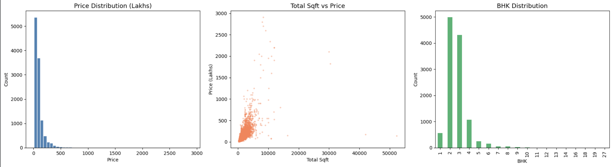
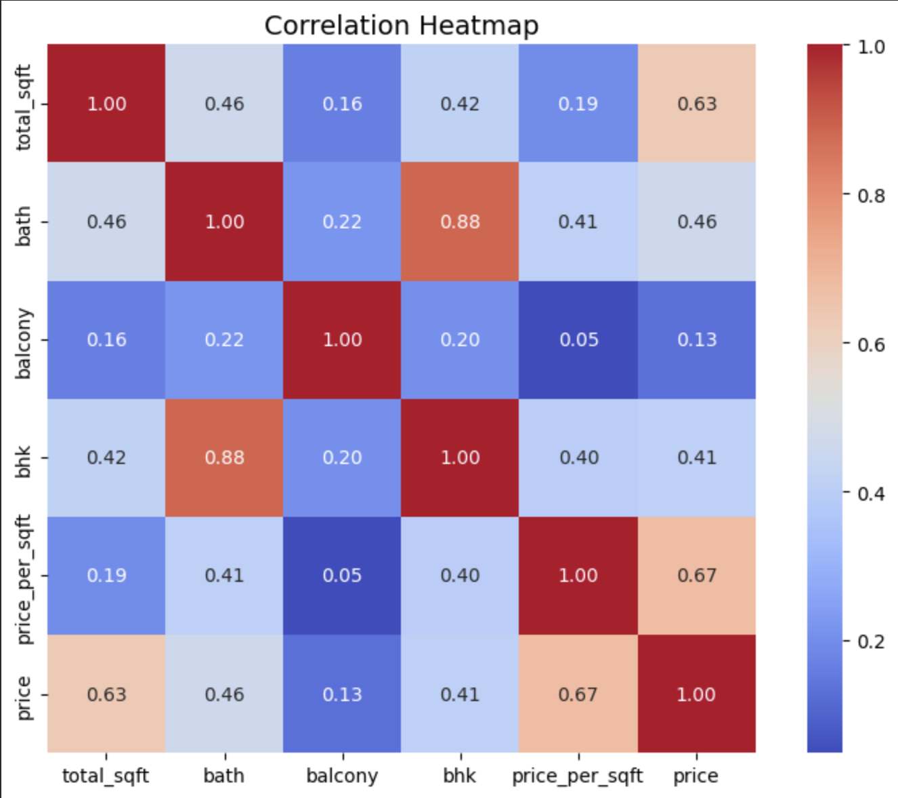
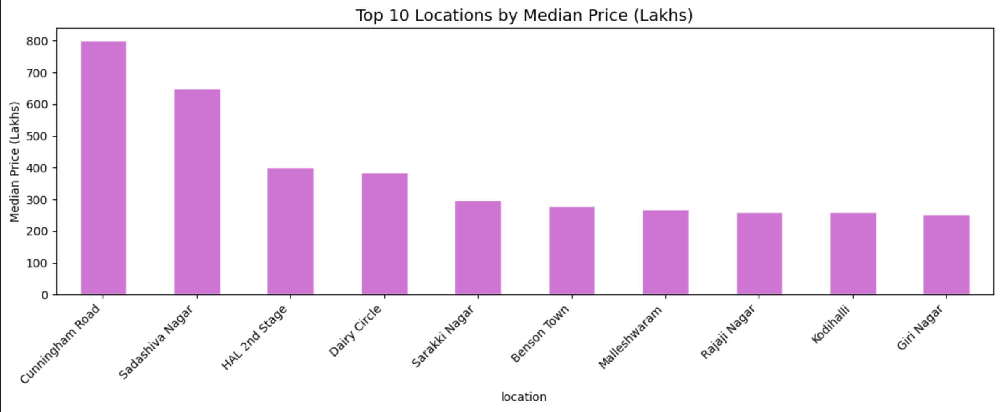
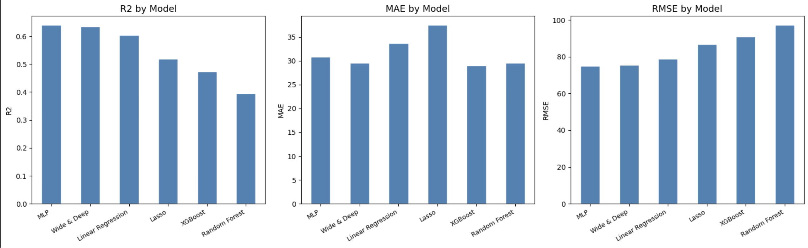

# Real Estate Price Prediction — Model Documentation

## Objective
Predict real estate prices in Bengaluru using ML and Deep Learning models on the Bengaluru House Price dataset.

---

## Approach

### 1. Data Preprocessing
- Handle missing values in `bath`, `balcony`, `society`
- Parse `size`: extract numeric BHK (e.g., "2 BHK" → 2)
- Handle `total_sqft` ranges (e.g., "2000–2500" → 2250)
- Engineer `price_per_sqft` feature
- Remove outliers using mean ± std deviation per location group
- Group rare locations (< 10 listings) as "other"
- One-Hot Encode `location` and `area_type`

### 2. Exploratory Data Analysis (EDA)
- Price distribution across top locations (bar/violin plots)
- Correlation heatmap of numerical features
- Scatter: `total_sqft` vs `price`
- Box plots for outlier visualization

### 3. Models Implemented

#### Machine Learning Baseline
| Model | Notes |
|-------|-------|
| Linear Regression | Baseline |
| Lasso Regression | L1 regularization; feature selection |
| Random Forest | Ensemble; handles non-linearity |
| XGBoost | Gradient boosting; top ML performer |

Tuning: GridSearchCV with 5-Fold Cross Validation

#### Deep Learning Models
| Model | Notes |
|-------|-------|
| MLP (Feedforward NN) | ReLU + Dropout + BatchNorm layers |
| Wide & Deep Network | Linear memorization + deep generalization (Google) |

Stack: PyTorch with Adam optimizer, ReduceLROnPlateau scheduler, 50 epochs

### 4. Evaluation Metrics
| Metric | Description |
|--------|-------------|
| R² Score | Proportion of variance explained |
| MAE | Mean Absolute Error (Lakhs INR) |
| RMSE | Root Mean Squared Error (Lakhs INR) |
| Cross-val Score | 5-fold CV for reliability |

---

## Results

| Model | R² | MAE (Lakhs) | RMSE (Lakhs) |
|-------|----|-------------|--------------|
| **MLP** | **~0.65** | **~29** | **~75** |
| **Wide & Deep** | **~0.65** | **~30** | **~75** |
| Linear Regression | ~0.60 | ~33 | ~78 |
| XGBoost | ~0.47 | ~29 | ~87 |
| Lasso Regression | ~0.51 | ~37 | ~83 |
| Random Forest | ~0.39 | ~37 | ~97 |

> 🏆 **Best Models: MLP and Wide & Deep Network** — highest R² and lowest RMSE across all models tested.

---

## Visualizations

### EDA Overview

### Correlation Heatmap

### Top Locations by Median Price

### Model Comparison

---

## Conclusions

### 🥇 Best Model: MLP (Feedforward Neural Network)
Achieved R² ~0.65 and RMSE ~75 Lakhs — the best performance among all models. Wide & Deep Network matched it closely, validating Google's architecture for real estate tabular data.

### Model Rankings
| Rank | Model | Reason |
|------|-------|---------|
| 🥇 1 | MLP / Wide & Deep | Best R², MAE, RMSE across all metrics |
| 🥈 2 | Linear Regression | Strong baseline on high-dimensional OHE data |
| 🥉 3 | XGBoost | Good MAE but needs hyperparameter tuning |
| 4 | Lasso Regression | Over-penalized; feature selection hurt performance |
| 5 | Random Forest | Weakest — needs deeper tuning (n_estimators, max_depth) |

### Key Insights
- **Location dominates**: After OHE, location dummies are the most influential features
- **DL wins on sparse high-dim data**: 500+ OHE features favor neural networks over tree-based models
- **XGBoost potential**: With GridSearchCV tuning, XGBoost could close the gap significantly
- **Wide & Deep validated**: Google's architecture works well on structured real estate data

### Suggestions for Improvement
- Run GridSearchCV on XGBoost for better tree-based performance
- Add TabNet for interpretable attention-based feature importance
- Try entity embeddings for `location` instead of OHE to reduce dimensionality
- Collect more data — ~13K rows is moderate; more data would benefit Random Forest

---

## Saved Artifacts
- `real_estate_best_model.pkl` — Best ML model (XGBoost, saved via joblib)
- MLP and Wide & Deep weights saveable via `torch.save(model.state_dict(), 'model.pt')`
